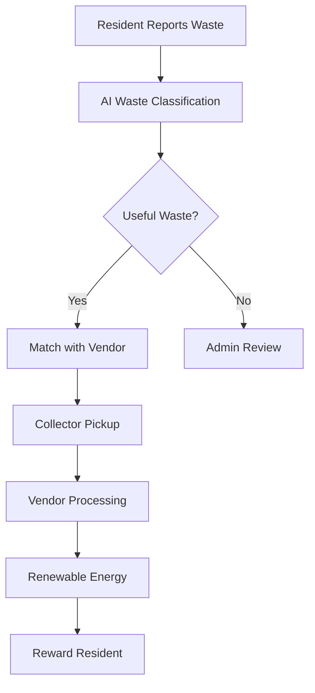
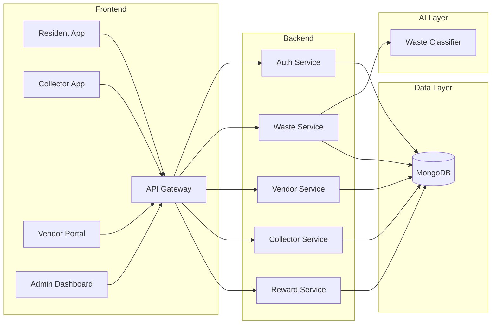
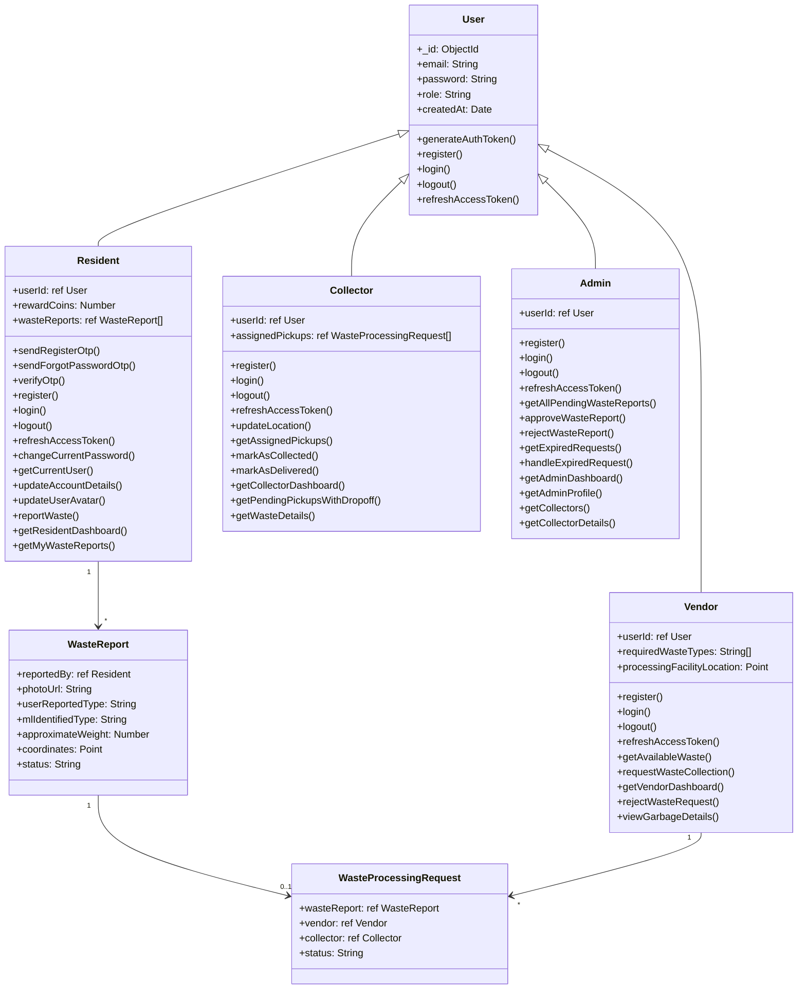
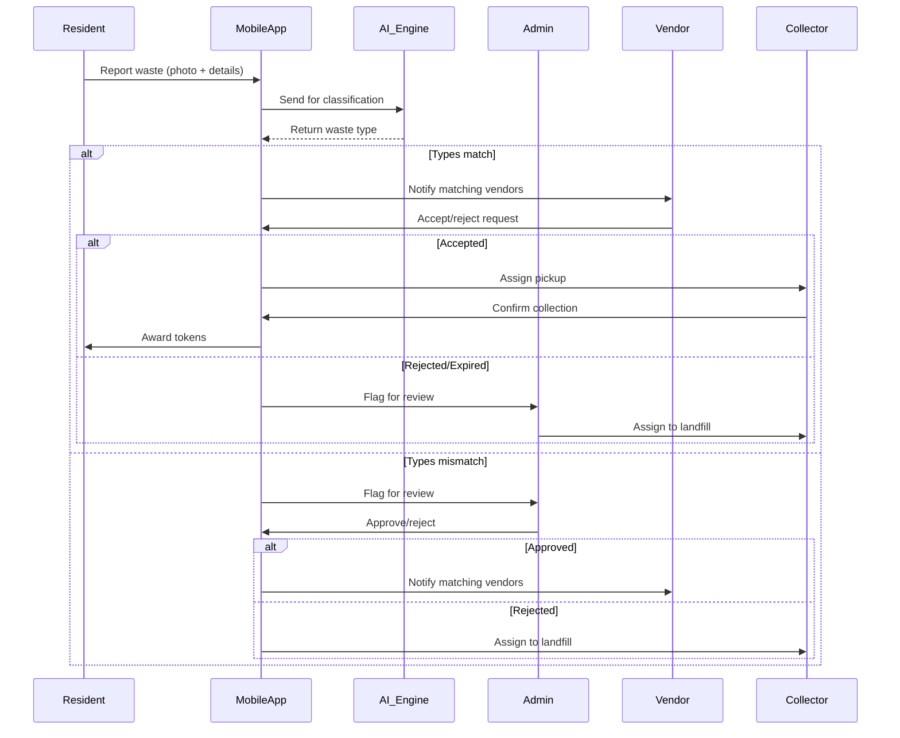

# ♻️ Waste-to-Energy: Smart Waste Management & Recycling System

**Transform Waste into Value** • **Reduce Landfill Waste** • **Create Sustainable Communities**

## 🌟 Introduction
Waste-to-Energy is an innovative smart waste management platform that transforms municipal solid waste into renewable energy resources. Our solution combines IoT, machine learning, and blockchain technologies to create circular economies where waste becomes a valuable resource rather than an environmental burden.

## 📌 Problem Statement
- **2.01 billion tonnes** of municipal solid waste generated annually worldwide
- **33%** of global waste is mismanaged through open dumping or burning
- Waste sector contributes to **5%** of global greenhouse gas emissions
- Current recycling rates average just **13.5%** globally

## 💡 Our Solution
A comprehensive platform that:
1. Uses computer vision for automatic waste classification
2. Connects residents with waste processing vendors
3. Converts organic waste into bioenergy pellets via torrefaction
4. Transforms landfill gas into renewable energy
5. Implements a reward system to incentivize recycling

## ✨ Key Features

### 🧠 AI-Powered Waste Recognition
- Real-time waste classification using computer vision
- 95% accuracy across 8 waste categories
- Mobile-optimized for field use

### 🔄 Circular Economy Marketplace
- Match waste generators with processing vendors
- Dynamic pricing based on waste composition
- Geospatial matching within 10km radius

### ⚡ Energy Recovery Systems
- Torrefaction converts organic waste to bio-coal
- Landfill gas capture for electricity generation
- Real-time energy production dashboard

### 🏆 Gamified Recycling
- Reward tokens for proper waste disposal
- Community leaderboards and challenges
- Token redemption for local services

## 🛠️ Technology Stack

### Backend
- **Node.js** with **Express.js** framework
- **MongoDB** with **Mongoose** (Geospatial indexing)

### AI/ML
- **YOLO** for waste classification

### Frontend
- **HTML/CSS/JS** 
- **leaflet-OpenStreetMap** for geospatial visualization
- **Chart.js** for data dashboards

## 📊 System Architecture

## 👥 Use Case Diagram

## 🧩 Class Diagram

## 🔄 Core Workflow Sequence

## 📈 Impact Metrics
- **76%** reduction in landfill waste
- **42%** increase in recycling rates
- **28 tonnes** CO₂ reduced per facility monthly
- **12.5 MW** renewable energy generated daily

## 🔮 Future Roadmap
- **Blockchain Integration**: Transparent waste tracking using Ethereum
- **IoT Smart Bins**: Real-time fill-level monitoring
- **Carbon Credit Marketplace**: Tokenize emission reductions
- **AR Recycling Guides**: Interactive waste sorting tutorials
- **Predictive Analytics**: Waste generation forecasting models

## 🤝 Contributors
- Yashansh Raj Pandey(Project Lead)
- Gajendra Singh Thakur (ML Engineer)
- Pawan Kumar Rajak (Fullstack Developer)
- Himanshu Dhepe (Management and requirement gathering)

## 📜 License
This project is licensed under the MIT License - see the [LICENSE.md](LICENSE) file for details.

---
