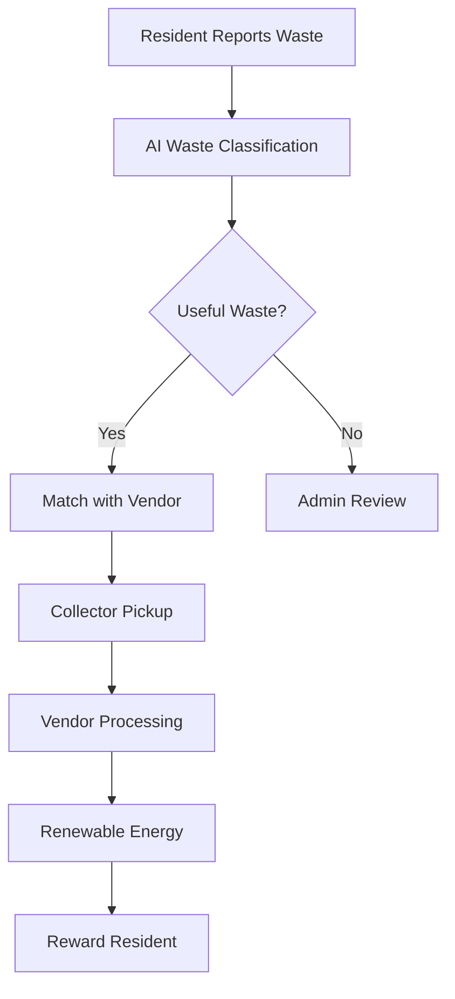
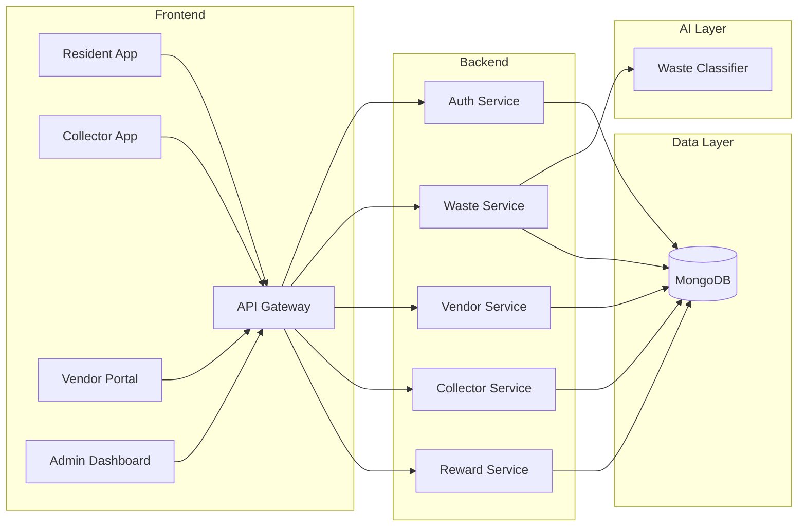
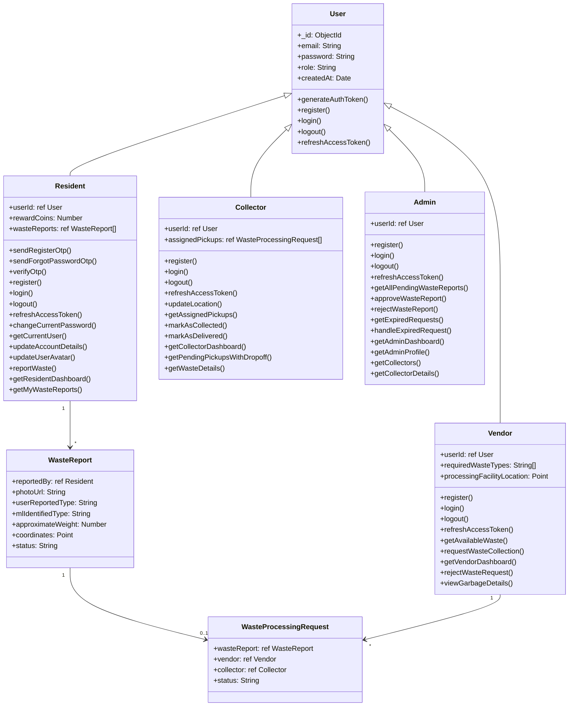
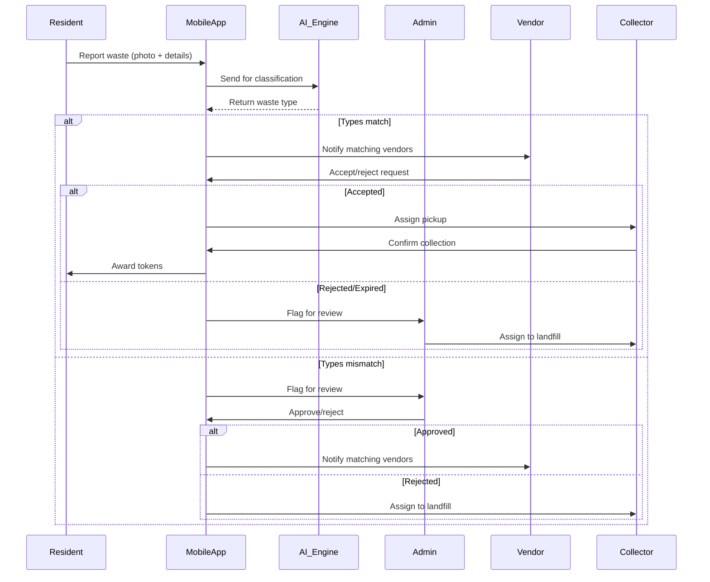

# ♻️ Waste-to-Energy: Smart Waste Management & Recycling System


**Transform Waste into Value** • **Reduce Landfill Waste** • **Create Sustainable Communities**

## 🌟 Introduction
Waste-to-Energy is an innovative smart waste management platform that transforms municipal solid waste into renewable energy resources. Our solution combines IoT, machine learning, and blockchain technologies to create circular economies where waste becomes a valuable resource rather than an environmental burden.

[](https://opensource.org/licenses/MIT)

## 📌 Problem Statement
- **2.01 billion tonnes** of municipal solid waste generated annually worldwide
- **33%** of global waste is mismanaged through open dumping or burning
- Waste sector contributes to **5%** of global greenhouse gas emissions
- Current recycling rates average just **13.5%** globally

## 💡 Our Solution
A comprehensive platform that:
1. Uses computer vision for automatic waste classification
2. Connects residents with waste processing vendors
3. Converts organic waste into bioenergy pellets via torrefaction
4. Transforms landfill gas into renewable energy
5. Implements a reward system to incentivize recycling



## ✨ Key Features

### 🧠 AI-Powered Waste Recognition
- Real-time waste classification using computer vision
- 95% accuracy across 8 waste categories
- Mobile-optimized for field use

### 🔄 Circular Economy Marketplace
- Match waste generators with processing vendors
- Dynamic pricing based on waste composition
- Geospatial matching within 10km radius

### ⚡ Energy Recovery Systems
- Torrefaction converts organic waste to bio-coal
- Landfill gas capture for electricity generation
- Real-time energy production dashboard

### 🏆 Gamified Recycling
- Reward tokens for proper waste disposal
- Community leaderboards and challenges
- Token redemption for local services

## 🛠️ Technology Stack

### Backend
- **Node.js** with **Express.js** framework
- **MongoDB** with **Mongoose** (Geospatial indexing)

### AI/ML
- **YOLO** for waste classification

### Frontend
- **HTML/CSS/JS** 
- **leaflet-OpenStreetMap** for geospatial visualization
- **Chart.js** for data dashboards


## 📊 System Architecture



## 👥 Use Case Diagram


## 🧩 Class Diagram



## 🔄 Core Workflow Sequence



## 🚀 How to Use the Waste-to-Energy Smart Waste Management Application

This guide will help **any user** set up, configure, and run the application on their own machine.

---

### 🛠️ Prerequisites

- **Node.js** (v16+ recommended): [Download Node.js](https://nodejs.org/)
- **Python** (v3.8+ recommended): [Download Python](https://www.python.org/downloads/)
- **MongoDB**: [Download MongoDB](https://www.mongodb.com/try/download/community)
- **Git** (optional, for cloning): [Download Git](https://git-scm.com/downloads)

---

### 📦 Project Structure

```
CodeCrux/
│
├── src/
│   ├── ML/                # Python ML model & weights
│   ├── controllers/       # Node.js controllers
│   ├── models/            # Mongoose models
│   ├── routes/            # Express routes
│   ├── utils/             # Utility functions
│   ├── app.js             # Express app setup
│   └── index.js           # Entry point for Node.js server
│
├── public/                # Static HTML/CSS/JS files
└── ...
```

---

### 1️⃣ Clone the Repository

```sh
git clone https://github.com/pawan-kumar-rajak/CodeCrux
cd CodeCrux
```

---

### 2️⃣ Configure Environment Variables

- Copy `.env.example` to .env (if provided) and fill in your MongoDB URI, email credentials, etc.
- Example .env:
  ```
    PORT=8000
    MONGO_URI=
    DB_NAME=

    <!-- you can change image storage from cloud to local -->
    CLOUDINARY_CLOUD_NAME=
    CLOUDINARY_API_KEY=
    CLOUDINARY_API_SECRET=


    ACCESS_TOKEN_SECRET=
    ACCESS_TOKEN_EXPIRY=1hr
    REFRESH_TOKEN_SECRET=
    REFRESH_TOKEN_EXPIRY=30d


    <!-- for email sending for otps and other -->
    EMAIL=
    EMAIL_PASSWORD=
  ```

---

### 3️⃣ Install Node.js Dependencies

```sh
npm install
```

---

### 4️⃣ Set Up Python Environment for ML

```sh
cd src/ML
python -m venv venv
venv\Scripts\activate   # On Windows
# source venv/bin/activate   # On Linux/Mac
# copy requirement.txt file inside venv folder then run these commands
pip install -r requirements.txt
# If requirements.txt is missing, install manually:
pip install flask ultralytics opencv-python torch
```

- Make sure your YOLO model weights (e.g., `best.pt`) are in Weights.

---

### 5️⃣ Start the Python ML Server

```sh
# make sure that your virtual environment is activated
# you'll see (venv) at left most of terminal inline
python GARBAGENEW.PY
```

- This will start a Flask server on `http://localhost:3000` (or as configured).

---

### 6️⃣ Start MongoDB

- Make sure MongoDB is running

---

### 7️⃣ Start the Node.js Server

```sh
cd ../
# open another terminal and run
npm run dev 
```

- The server will run on `http://localhost:5000` (or as configured).

---

### 8️⃣ Using the Application

- **Frontend:** Open your browser and go to `http://localhost:5000`.
- ** then click on login button at top right corner
- **Resident, Vendor, Collector, Admin** dashboards are available via the navigation or direct URLs.
- **Waste Reporting:** Residents can upload images; the backend will call the Python ML server to classify waste.

---

### ⚡ How ML Integration Works

- When a user uploads a waste image, Node.js sends the image to the Python Flask server (`/detect` endpoint).
- The ML server returns detected waste type and recyclability.
- Node.js saves the result and updates the user dashboard.
- **you can see predictions of ml in terminal where python flask server is runninng**

---

### 📝 Notes

- **Both Node.js and Python servers must be running** for full functionality.
- If you change the ML server port or host, update the URL in your Node.js controller (see `axios.post('http://localhost:5000/detect', ...)`).
- For production, use environment variables for all secrets and URLs.

---

### 🆘 Troubleshooting

- **Port conflicts:** Make sure nothing else is running on ports 5000 (Node.js) and 3000 (Python ML).
- **Python errors:** Ensure all required Python packages are installed and the correct weights file is present.
- **MongoDB errors:** Make sure MongoDB is running and accessible.

---

## 🙋 Need Help?

- Check the README and code comments.
- Open an issue on the repository or contact the maintainer.

---


## 📈 Impact Metrics
- **76%** reduction in landfill waste
- **42%** increase in recycling rates
- **28 tonnes** CO₂ reduced per facility monthly
- **12.5 MW** renewable energy generated daily

## 🔮 Future Roadmap
- **Blockchain Integration**: Transparent waste tracking using Ethereum
- **IoT Smart Bins**: Real-time fill-level monitoring
- **Carbon Credit Marketplace**: Tokenize emission reductions
- **AR Recycling Guides**: Interactive waste sorting tutorials
- **Predictive Analytics**: Waste generation forecasting models

## 🤝 Contributors
- Yashansh Raj Pandey(Project Lead)
- Gajendra Singh Thakur (ML Engineer)
- Pawan Kumar Rajak (Fullstack Developer)
- Himanshu Dhepe (Management and requirement gathering)

## 📜 License
This project is licensed under the MIT License - see the [LICENSE.md](LICENSE) file for details.

---
