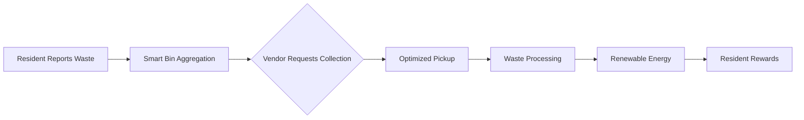
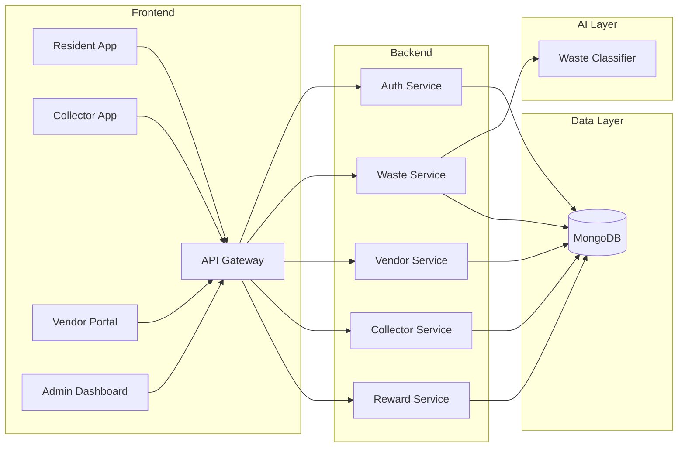
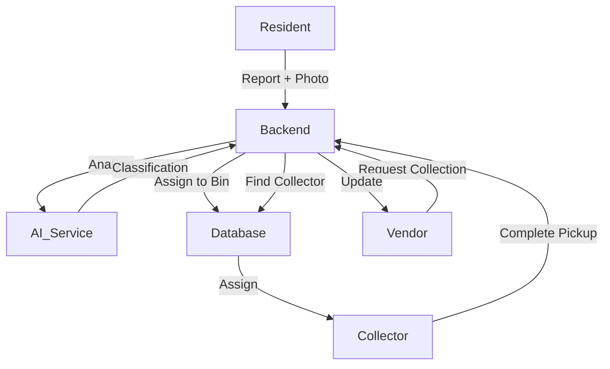
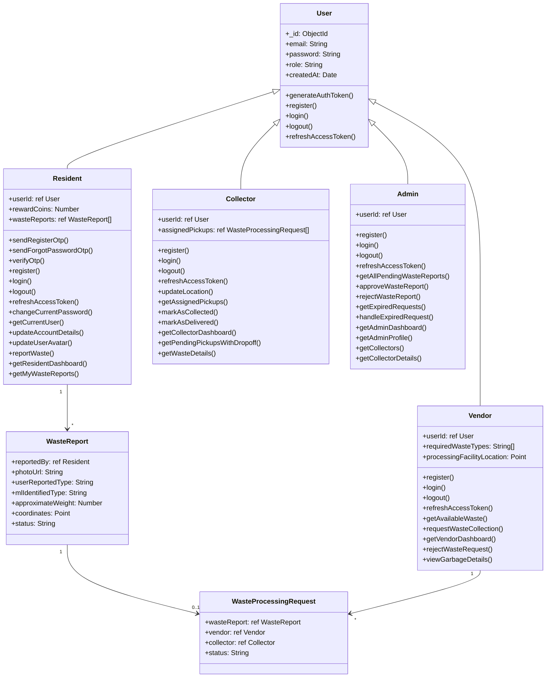
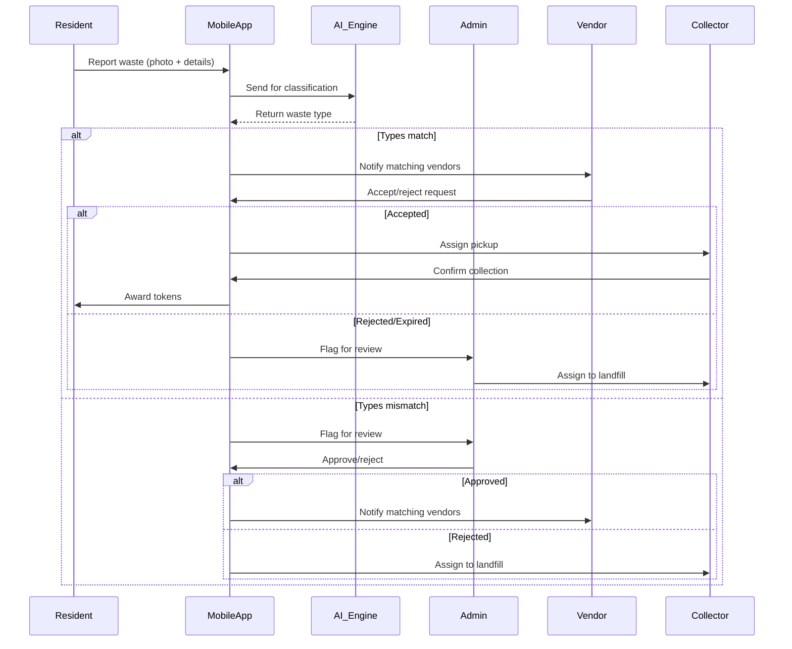
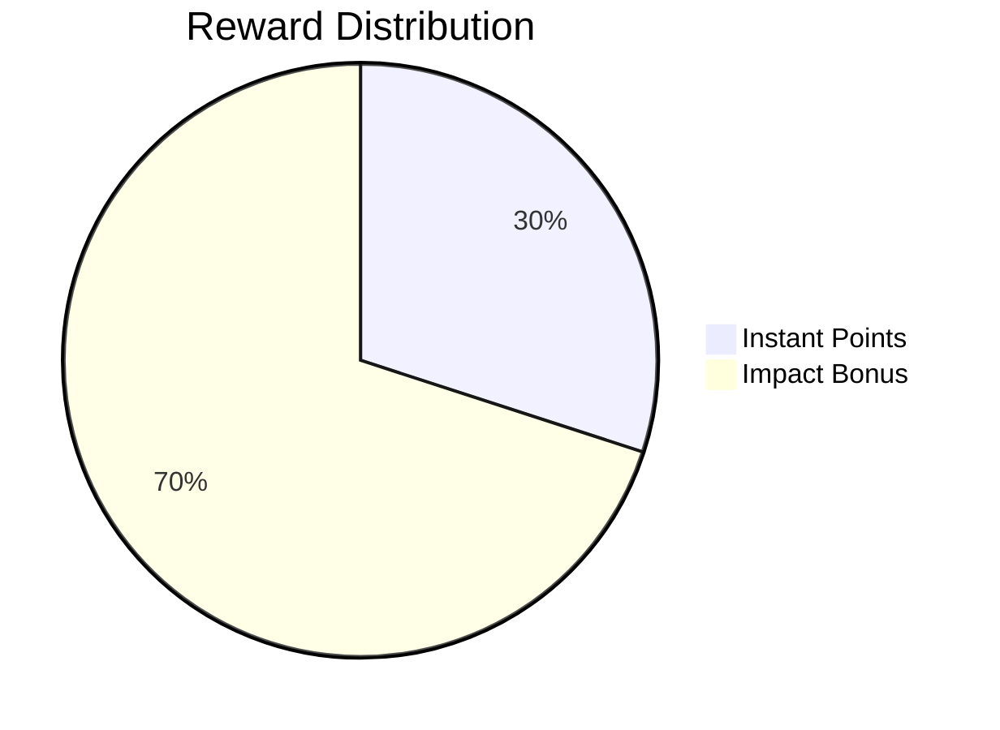

# ♻️ EcoChain: Smart Waste-to-Energy & Recycling Management System  

**Revolutionizing urban waste management through AI-powered optimization and community engagement**  


---

## 📌 Problem Statement
- **2.01 billion tonnes** of municipal solid waste generated annually worldwide
- **33%** of global waste is mismanaged through open dumping or burning
- Waste sector contributes to **5%** of global greenhouse gas emissions
- Current recycling rates average just **13.5%** globally

---

## 🌍 The Waste Management Challenge  
Traditional waste systems struggle with critical inefficiencies:  
- 🚛 **Inefficient logistics** - Collection trucks visiting half-empty bins  
- 🔄 **Low recycling rates** - Only 9% of plastic gets recycled globally  
- 🌫️ **Environmental damage** - Landfills generate 14% of global methane emissions  
- 💡 **Lack of incentives** - Residents aren't rewarded for proper waste disposal  


---

## 🚀 Our Innovative Solution  
EcoChain transforms waste from trash to treasure with a bin-centric approach:  



**Core innovation:**  
🔋 Waste becomes an on-demand commodity for energy production  
🔄 Collection only when bins reach capacity or vendors request materials  
🌱 Complete circular economy with transparent tracking  

---

## 🏗️ System Architecture  



### 🔄 Data Flow Ecosystem  



### 🧩 Class Diagram



### 🔄 Core Workflow Sequence




### Use Case


### 📊 Key Components  
| Component | Technology | Purpose |
|-----------|------------|---------|
| **Backend** | Node.js + Express | Core application logic |
| **AI Service** | Python + YOLOv8 | Waste classification |
| **Database** | MongoDB | Geospatial data storage |
| **Frontend** | Vanilla JS + Chart.js | Interactive dashboards |
| **Auth** | JWT | Secure authentication |
| **Storage** | Cloudinary | Image management |

---

## ✨ Key Features  

### 👨‍👩‍👧‍👦 For Residents  
- 📸 **Smart reporting** - AI-assisted waste classification  
- 🏆 **Two-tier rewards** - Instant points + impact bonuses  
- 📊 **Personal dashboard** - Track your environmental impact  
- 🗺️ **Live tracking** - Follow your waste from bin to energy  

 
 

### 🚚 For Collectors  
- 🧭 **Optimized routes** - AI-generated efficient collection paths  
- 📍 **Live map view** - Real-time bin locations and status  
- ✅ **Task management** - Simple pickup/delivery confirmation  
- ⏱️ **Time savings** - 40% less travel time on average  
 

### 🏭 For Vendors  
- 🔎 **Waste marketplace** - Find specific materials on demand  
- 📈 **Performance analytics** - Track energy production metrics  
- ⚡ **Streamlined requests** - One-click collection scheduling  
- 🌱 **Impact reporting** - Quantify your environmental contribution  
 

### 👩‍💼 For Administrators  
- 📋 **Central dashboard** - Monitor system-wide performance  
- 🧩 **Data verification** - Review AI classification results  
- 👥 **User management** - Manage all stakeholder accounts  
- 🌎 **Environmental reports** - CO2 reduction and energy metrics  

---

## 🧠 Intelligent Backend Systems  

### 🎯 Two-Stage Reward System  

**Why it works:**  
- 💰 Immediate gratification for participation  
- 🌟 Significant rewards tied to actual environmental impact  
- 🛡️ Prevents gaming of the system  

### 📍 Optimized Collector Assignment  
**How it works:**  
1. Vendor requests bin collection  
2. System identifies bin location and zone  
3. Finds nearest available collector using geospatial queries  
4. Automatically assigns task with optimized route  

**Result:** 35% reduction in collection vehicle emissions  

### 🔒 Transactional Safety  
Critical operations use MongoDB transactions:  
```javascript
try {
  await session.withTransaction(async () => {
    // 1. Deduct resident rewards
    // 2. Update bin composition
    // 3. Recalculate fill level
    // 4. Delete report
  });
} catch (error) {
  // Rollback all changes
}
```
Ensures data consistency during deletions and updates  

---

## 🔮 Future Vision  

| Feature | Status | Impact Potential |
|---------|--------|------------------|
| **Real-time Route Optimization** | In development | 50%+ fuel savings |
| **IoT Smart Bin Integration** | Prototype stage | Automated fill monitoring |
| **Predictive Analytics** | Research phase | Forecast waste patterns |
| **Carbon Credit Marketplace** | Concept | Monetize CO2 reductions |
| **Community Leaderboards** | Planned | Boost resident engagement |


---

## 🛠️ Getting Started  
### 🛠️ Prerequisites

- **Node.js** (v16+ recommended): [Download Node.js](https://nodejs.org/)
- **Python** (v3.8+ recommended): [Download Python](https://www.python.org/downloads/)
- **MongoDB**: [Download MongoDB](https://www.mongodb.com/try/download/community)
- **Git** (optional, for cloning): [Download Git](https://git-scm.com/downloads)

---

### 📦 Project Structure

```
CodeCrux/
│
├── src/
│   ├── ML/                # Python ML model & weights
│   ├── controllers/       # Node.js controllers
│   ├── models/            # Mongoose models
│   ├── routes/            # Express routes
│   ├── utils/             # Utility functions
│   ├── app.js             # Express app setup
│   └── index.js           # Entry point for Node.js server
│
├── public/                # Static HTML/CSS/JS files
└── ...
```

---

### 1️⃣ Clone the Repository

```sh
git clone https://github.com/pawan-kumar-rajak/CodeCrux
cd CodeCrux
```

---

### 2️⃣ Configure Environment Variables

- Copy `.env.example` to .env (if provided) and fill in your MongoDB URI, email credentials, etc.
- Example .env:
  ```
    PORT=8000
    MONGO_URI=
    DB_NAME=

    <!-- you can change image storage from cloud to local -->
    CLOUDINARY_CLOUD_NAME=
    CLOUDINARY_API_KEY=
    CLOUDINARY_API_SECRET=


    ACCESS_TOKEN_SECRET=
    ACCESS_TOKEN_EXPIRY=1hr
    REFRESH_TOKEN_SECRET=
    REFRESH_TOKEN_EXPIRY=30d


    <!-- for email sending for otps and other -->
    EMAIL=
    EMAIL_PASSWORD=
  ```

---

### 3️⃣ Install Node.js Dependencies

```sh
npm install
```

---

### 4️⃣ Set Up Python Environment for ML

```sh
cd src/ML
python -m venv venv
venv\Scripts\activate   # On Windows
# source venv/bin/activate   # On Linux/Mac
# copy requirement.txt file inside venv folder then run these commands
pip install -r requirements.txt
# If requirements.txt is missing, install manually:
pip install flask ultralytics opencv-python torch
```

- Make sure your YOLO model weights (e.g., `best.pt`) are in Weights.

---

### 5️⃣ Start the Python ML Server

```sh
# make sure that your virtual environment is activated
# you'll see (venv) at left most of terminal inline
# make sure to be under src/ML/
python GARBAGENEW.PY
```

- This will start a Flask server on `http://localhost:3000` (or as configured).

---

### 6️⃣ Start MongoDB

- Make sure MongoDB is running

---

### 7️⃣ Start the Node.js Server

```sh
cd ../
# open another terminal and run
npm run dev 
```

- The server will run on `http://localhost:5000` (or as configured).
- if got mongodb error ( its because you are running mongodb locally and transaction not supporting local storage)
- [fix it](mongodb.md)

---

### 8️⃣ Using the Application

- **Frontend:** Open your browser and go to `http://localhost:5000`.
- ** then click on login button at top right corner
- **Resident, Vendor, Collector, Admin** dashboards are available via the navigation or direct URLs.
- **Waste Reporting:** Residents can upload images; the backend will call the Python ML server to classify waste.

---

### ⚡ How ML Integration Works

- When a user uploads a waste image, Node.js sends the image to the Python Flask server (`/detect` endpoint).
- The ML server returns detected waste type and recyclability.
- Node.js saves the result and updates the user dashboard.
- **you can see predictions of ml in terminal where python flask server is runninng**

---

### 📝 Notes

- **Both Node.js and Python servers must be running** for full functionality.
- If you change the ML server port or host, update the URL in your Node.js controller (see `axios.post('http://localhost:5000/detect', ...)`).
- For production, use environment variables for all secrets and URLs.

---

### 🆘 Troubleshooting

- **Port conflicts:** Make sure nothing else is running on ports 5000 (Node.js) and 3000 (Python ML).
- **Python errors:** Ensure all required Python packages are installed and the correct weights file is present.
- **MongoDB errors:** Make sure MongoDB is running and accessible.

---

## 🙋 Need Help?

- Check the README and code comments.
- Open an issue on the repository or contact the maintainer.

---

## 🤝 Contribute to a Cleaner Future  
We welcome contributions! Here's how to get involved:  
1. 🐛 Report bugs in our issue tracker  
2. 💡 Suggest new features or improvements  
3. 👨‍💻 Submit pull requests for open issues  
4. 🌍 Help translate the interface  

**Join our community:** [EcoChain Discord Server](https://discord.gg/ecochain)  

---
<!-- ## 🤝 Contributors
- [Yashansh Raj Pandey (Project Lead)](https://github.com/yashanshhhraj)
- [Gajendra Singh Thakur (ML Engineer)](https://github.com/Gajendra-dev-ux)
- [Pawan Kumar Rajak (Fullstack Developer)](https://github.com/pawan-kumar-rajak)
- [Himanshu Dhepe (Management and requirement gathering)](https://github.com/himanshu1hd)

--- -->

## 📜 License  
EcoChain is released under the [MIT License](LICENSE.md) - free for educational and non-commercial use. For commercial applications, please contact our team.  

---

**Together, we're transforming waste into worth, one smart bin at a time.** ♻️💡
